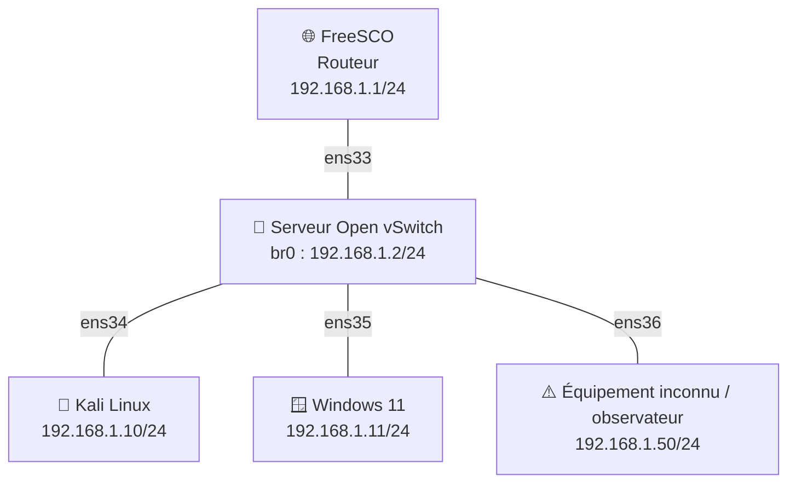
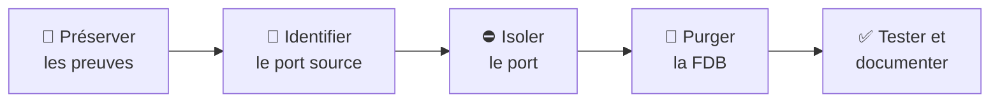

# 🛡️ OVS-ARPSCAN-MACOF


> **Cours et travaux pratiques consacrés au protocole ARP, à l’inventaire défensif avec `arp-scan`, à la démonstration contrôlée de MAC flooding avec `macof` et aux mécanismes de remédiation proposés par Open vSwitch.**

---

## 📚 Présentation

Ce dépôt accompagne une séance pédagogique destinée principalement aux étudiants de **BTS SIO**, option **SISR**.

Le laboratoire permet de :

- comprendre le fonctionnement du protocole ARP ;
- observer les requêtes et réponses ARP ;
- consulter les caches de voisinage Linux et Windows ;
- inventorier les équipements d’un LAN avec `arp-scan` ;
- observer la table FDB d’Open vSwitch ;
- démontrer de façon encadrée les effets possibles de `macof` ;
- différencier **MAC flooding**, **ARP spoofing** et **attaque MITM** ;
- mettre en œuvre des mesures de détection, de confinement et de remédiation.

> [!IMPORTANT]
> `macof` ne réalise pas automatiquement un empoisonnement ARP et ne garantit pas une attaque MITM. Il génère des trames avec de nombreuses adresses MAC sources afin de perturber l’apprentissage de la table FDB du commutateur.

---

## 🗺️ Topologie du laboratoire



Open vSwitch assure uniquement la **commutation de couche 2**. FreeSCO reste l’unique routeur et la passerelle IPv4 du laboratoire.

### 📋 Plan d’adressage

| Équipement | Interface OVS | Adresse IPv4 | Rôle | Statut |
|---|---:|---:|---|---|
| 🌐 FreeSCO | `ens33` | `192.168.1.1/24` | Routeur et passerelle | Autorisé |
| 🔀 Open vSwitch `br0` | Interne | `192.168.1.2/24` | Commutateur et administration | Autorisé |
| 🐉 Kali Linux | `ens34` | `192.168.1.10/24` | Analyse, `arp-scan` et démonstration | Autorisé |
| 🪟 Windows 11 | `ens35` | `192.168.1.11/24` | Poste client | Autorisé |
| ⚠️ Équipement inconnu | `ens36` | `192.168.1.50/24` | Détection ou observation | À qualifier |
| 🧪 Réseau du laboratoire | — | `192.168.1.0/24` | Domaine de diffusion ARP | Isolé |

---

## 🧰 Prérequis

### Infrastructure

- un hyperviseur : VMware Workstation, VirtualBox, Proxmox ou équivalent ;
- un réseau virtuel **Host-only** ou totalement isolé ;
- une VM FreeSCO ;
- une VM Debian ou Ubuntu équipée de quatre interfaces pour Open vSwitch ;
- une VM Kali Linux ;
- une VM Windows 11 ;
- éventuellement une machine supplémentaire servant d’équipement inconnu ou d’observateur.

### Logiciels

```bash
sudo apt update
sudo apt install -y openvswitch-switch arp-scan tcpdump wireshark dsniff
```

---

## ⚙️ Mise en place d’Open vSwitch

```bash
sudo systemctl enable --now openvswitch-switch

sudo ovs-vsctl --may-exist add-br br0
sudo ovs-vsctl --may-exist add-port br0 ens33
sudo ovs-vsctl --may-exist add-port br0 ens34
sudo ovs-vsctl --may-exist add-port br0 ens35
sudo ovs-vsctl --may-exist add-port br0 ens36

sudo ip link set br0 up
sudo ip addr replace 192.168.1.2/24 dev br0
```

Les interfaces physiques membres du bridge ne doivent pas porter les adresses IP des postes. L’adresse d’administration du serveur OVS est affectée à `br0`.

### 🔎 Vérifications

```bash
sudo ovs-vsctl show
sudo ovs-ofctl show br0
sudo ovs-ofctl dump-flows br0
sudo ovs-appctl fdb/show br0
ip -br addr show br0
```

---

## 🔍 Inventaire défensif avec ARP-SCAN

Identifier d’abord l’interface de Kali reliée au laboratoire :

```bash
ip -br addr
ip route
```

Lancer ensuite l’inventaire du LAN :

```bash
sudo arp-scan --interface=eth0 --localnet
```

Exporter les résultats :

```bash
sudo arp-scan --interface=eth0 --localnet --plain \
  | tee inventaire_avant.txt
```

Après isolement de l’équipement inconnu :

```bash
sudo arp-scan --interface=eth0 --localnet --plain \
  | tee inventaire_apres.txt

diff -u inventaire_avant.txt inventaire_apres.txt
```

> [!NOTE]
> Remplacer `eth0` par le nom réel de l’interface Kali. `arp-scan` ne découvre que les équipements situés dans le même domaine de diffusion de couche 2.

---

## 🧪 Scénario MACOF contrôlé

> [!CAUTION]
> Cette manipulation doit être réalisée exclusivement dans le LAN virtuel isolé `192.168.1.0/24`, sous la responsabilité du formateur. Ne jamais l’exécuter sur le réseau de l’établissement, un réseau Wi-Fi, un réseau d’entreprise ou Internet.

### 1. 📸 Préserver l’état initial

```bash
sudo ovs-appctl fdb/show br0 | tee /tmp/fdb_avant_macof.txt
sudo ovs-ofctl dump-flows br0
```

### 2. 🔀 Vérifier l’apprentissage normal

Uniquement si le bridge est réservé à ce TP et si aucune autre politique OpenFlow n’est nécessaire :

```bash
sudo ovs-ofctl del-flows br0
sudo ovs-ofctl add-flow br0 'priority=0,actions=NORMAL'
```

Le formateur peut temporairement réduire la table MAC pour rendre l’effet plus facilement observable :

```bash
sudo ovs-vsctl get Bridge br0 other_config
sudo ovs-vsctl set Bridge br0 other_config:mac-table-size=64
```

### 3. 📡 Générer et observer le trafic légitime

Sur Windows 11 :

```powershell
ping -t 192.168.1.1
```

Sur le serveur OVS, dans deux terminaux :

```bash
watch -n 0.5 'sudo ovs-appctl fdb/show br0'
```

```bash
sudo tcpdump -eni ens36 icmp -w /tmp/observation_macof.pcap
```

### 4. ⚠️ Lancer une émission bornée depuis Kali

```bash
sudo macof -i eth0 -n 500
```

L’option `-n 500` limite l’exercice à 500 trames. Adapter `eth0` au nom de l’interface du laboratoire.

### 5. 📊 Recueillir les preuves

```bash
sudo ovs-appctl fdb/show br0 | tee /tmp/fdb_pendant_macof.txt

sudo ovs-appctl fdb/show br0 \
  | awk 'NR>1 {n[$1]++} END {for (p in n) print p, n[p]}'

diff -u /tmp/fdb_avant_macof.txt /tmp/fdb_pendant_macof.txt
```

Résultats possibles :

- nombreuses adresses MAC apprises sur le port relié à Kali ;
- renouvellement ou éviction d’entrées légitimes de la FDB ;
- pertes ou variations temporaires du ping ;
- réception éventuelle, sur `ens36`, de trafic unicast qui ne lui était pas destiné.

Une capture vide sur `ens36` ne signifie pas nécessairement que MACOF n’a eu aucun effet : OVS peut réapprendre très rapidement les adresses légitimes.

### 6. 🧹 Arrêter et restaurer

Sur Kali, si le processus subsiste :

```bash
sudo pkill macof
```

Sur le serveur OVS :

```bash
sudo ovs-appctl fdb/flush br0
sudo ovs-vsctl remove Bridge br0 other_config mac-table-size
sudo ovs-appctl fdb/show br0
```

Générer ensuite du trafic légitime entre Kali, Windows et FreeSCO, puis vérifier que les MAC attendues réapparaissent sur les bons ports.

---

## 🛡️ Remédiation OpenFlow

### Liste blanche MAC sur le port Kali

Relever le numéro OpenFlow d’`ens34` sur le serveur OVS :

```bash
KALI_PORT=$(sudo ovs-vsctl get Interface ens34 ofport)
```

Relever la véritable adresse MAC sur Kali avec `ip link`, puis la reporter :

```bash
KALI_MAC=08:00:27:AA:BB:10  # exemple à remplacer
```

Appliquer les règles :

```bash
sudo ovs-ofctl add-flow br0 'priority=0,actions=NORMAL'

sudo ovs-ofctl add-flow br0 \
  "cookie=0x4d41434f46,priority=300,in_port=$KALI_PORT,dl_src=$KALI_MAC,actions=NORMAL"

sudo ovs-ofctl add-flow br0 \
  "cookie=0x4d41434f46,priority=200,in_port=$KALI_PORT,actions=drop"

sudo ovs-ofctl dump-flows br0
```

Cette politique autorise la MAC légitime de Kali et rejette les trames portant une autre MAC source sur le même port.

### ↩️ Retour arrière

```bash
sudo ovs-ofctl del-flows br0 'cookie=0x4d41434f46/-1'
```

> [!WARNING]
> Cette liste blanche ne remplace pas Dynamic ARP Inspection. Elle contrôle la MAC source admise sur un port, mais ne construit pas automatiquement une base fiable associant IP, MAC, VLAN et port.

---

## 🚨 Procédure de réponse à incident



Exemple d’isolement de l’équipement raccordé à `ens36` :

```bash
sudo ovs-appctl fdb/show br0
sudo ip link set ens36 down
sudo ovs-appctl fdb/flush br0
```

Après analyse et correction :

```bash
sudo ip link set ens36 up
sudo ovs-appctl fdb/show br0
```

---

## 🧠 À retenir

| Technique | Cible | Effet recherché | Preuve principale |
|---|---|---|---|
| 🔎 `arp-scan` | LAN local | Inventorier les hôtes | Liste IP/MAC |
| 🌊 MAC flooding | FDB du commutateur | Perturber l’apprentissage L2 | Nombreuses MAC sur un port |
| 🎭 ARP spoofing | Cache ARP des hôtes | Falsifier une association IP/MAC | Une IP légitime change de MAC |
| 🕵️ MITM | Flux entre deux systèmes | Intercepter ou modifier les échanges | Chemin détourné et trafic relayé |

Le MAC flooding peut créer des conditions favorables à l’observation de certaines trames, mais il ne constitue pas automatiquement un MITM.

---

## 📁 Organisation proposée du dépôt

```text
OVS-ARPSCAN-MACOF/
├── README.md
├── docs/
│   ├── topologie-laboratoire.png
│   
├── configs/
│   ├── ovs-installation.sh
│   ├── ovs-remediation.sh
│   └── ovs-rollback.sh
└── LICENSE
```

Ne pas publier de capture contenant des données réelles, des identifiants, des adresses publiques ou des informations personnelles.

---

## ✅ Livrables pédagogiques attendus

- `inventaire_avant.txt` ;
- `inventaire_apres.txt` ;
- `fdb_avant_macof.txt` ;
- `fdb_pendant_macof.txt` ;
- `observation_macof.pcap` ou `.pcapng` ;
- capture d’écran annotée de la FDB ;
- rapport court : faits, hypothèse, impact, confinement, correction et validation.

---

## 📖 Documentation utile

- [Documentation Open vSwitch](https://docs.openvswitch.org/)
- [Actions OpenFlow et traitement NORMAL](https://docs.openvswitch.org/en/latest/ref/ovs-actions.7/)
- [Documentation arp-scan](https://github.com/royhills/arp-scan)
- [Manuel Debian de macof](https://manpages.debian.org/testing/dsniff/macof.8.en.html)
- [Wireshark Display Filters](https://www.wireshark.org/docs/dfref/)

---

## ⚖️ Cadre légal et pédagogique

Ce projet est destiné à la **formation**, à l’**administration réseau** et à la **défense**. Toute expérimentation doit être réalisée sur une infrastructure appartenant à l’utilisateur ou pour laquelle une autorisation explicite a été obtenue.

L’auteur et les contributeurs ne sauraient être tenus responsables d’un usage non autorisé ou malveillant.

---

## 🤝 Contribution

Les propositions d’amélioration sont les bienvenues :

1. créer une branche dédiée ;
2. documenter précisément les modifications ;
3. tester les commandes dans un laboratoire isolé ;
4. ne jamais déposer de données sensibles ;
5. ouvrir une Pull Request claire et reproductible.

---

## 👨‍🏫 Auteur

**Stéphane Beteta - Formateur et ingénieur en informatique et cybersécurité**

Projet pédagogique consacré à ARP, à Open vSwitch, à la découverte réseau et à la remédiation défensive.

---

## 📄 Licence

Contenu pédagogique proposé sous licence **Creative Commons BY-NC-SA 4.0**, sauf mention contraire concernant les logiciels et marques cités.
